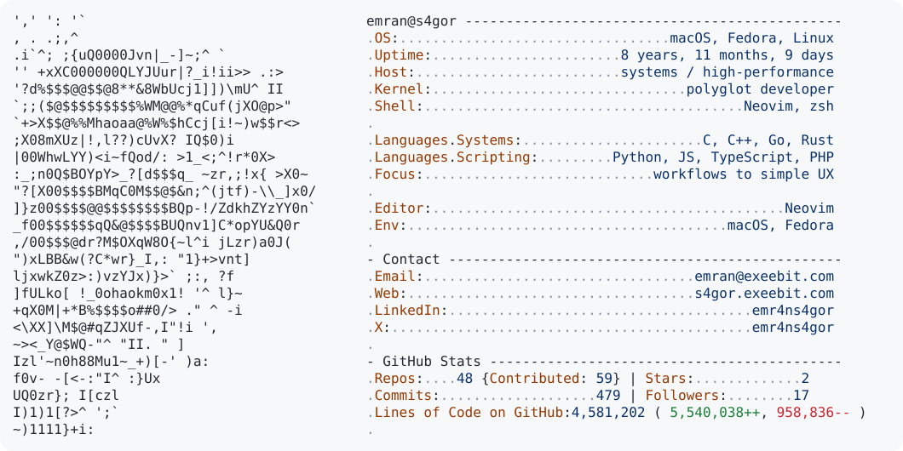

  <a href="https://github.com/s4gor/s4gor">
    <picture>
      <source media="(prefers-color-scheme: dark)" srcset="dark_mode.svg">
      
    </picture>
  </a>

  

---

### 👨‍💻 About Me

I am a polyglot developer passionate about systems programming and high-performance applications. My daily drivers are **C**, **C++**, **Go**, and **Rust**, but I'm equally comfortable in **Python**, **JavaScript**, **TypeScript**, and **PHP**.

I believe in efficiency and customization, which is why I exclusively use **Neovim** as my editor of choice, running on **macOS** and **Fedora**.

---

### 🐍 Contribution Snake

<picture>
  <source media="(prefers-color-scheme: dark)" srcset="https://raw.githubusercontent.com/s4gor/s4gor/output/snake.svg" />
  <source media="(prefers-color-scheme: light)" srcset="https://raw.githubusercontent.com/s4gor/s4gor/output/snake.svg" />
  
</picture>
